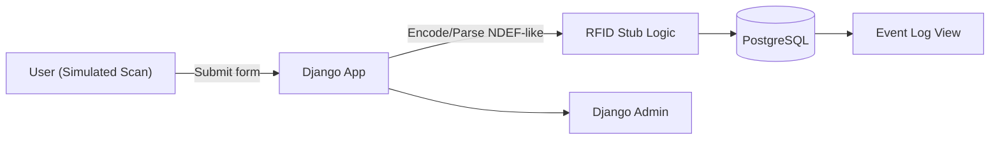

# FireWatch - Project Overview (Public)

This is a public-friendly **overview** of my senior capstone project **FireWatch**.
The original repository is private and owned by my team. This page shares **No private source code, credentials, or sensitive data are included.**

---

## What We Built (High Level)
A prototype web application that simulates **RFID-based firearm check-in/out** activity for an armory context.
- **Backend:** Django (Python)
- **Database:** PostgreSQL
- **Containerization:** Docker / Docker Compose
- **RFID Simulation:** Django form + server-side logic to generate/parse **NDEF-like** messages (via 'ndeflib' in dev)
- **Auth & Admin:** Django auth & admin for data entry/inspection

> Goal: demonstrate a realistic flow end-to-end (scan → encode/parse → store → display in event log) in a controlled, non-production environment.

---

## My Role
**RFID Reader Stub & Integration (primary):**
- Implemented the **RFID scan simulation** flow using a Django form and server-side generation of a random serial number.
- Encoded/parsed data in an **NDEF-like** structure (development used 'ndeflib') and persisted results to PostgreSQL.
- Integrated with existing **views, forms, and templates**; added event log entries to display scans.
- Wrote developer-facing notes and comments so the flow could be extended to a real reader later.

**Collaboration & Tooling:**
- Contributed to **Git/GitHub** workflows, code reviews, and documentation.
- Worked within Dockerized services for reproducible local dev.

---

## System Architecture (Conceptual)

**Flow summary:** User clicks "Simulate RFID Scan" → Django generates a serial number and encodes/decodes an NDEF-like payload → record saved in **PostgreSQL** → shown in **Event Log** and visible in **Django Admin**.

---

## Tech Stack
• Python, Django
• PostgreSQL
• Docker / Docker Compose
• GitHub Actions (CI basics)
• NDEF (development via ndeflib) for realistic message structure in the stub

---

## Screenshots

---

## Documentation
• 
•

---

## What's Not Included
• Private repository code and commit history
• Secrets, credentials, environment files, or network diagrams tied to any real system(s)
• Any content restricted by course/team policy

---

## Notes for Reviewers
• This project was built as a **senior capstone** prototype to validate feasibility and integration points.
• My focus was the **RFID simulation and data pipeline** (encode/parse → store → display) and ensuring the flow could later swap to a physical reader.

---

## License
This repository is shared for **portfolio and educational purposes only**.
All rights reserved © Linda L. Kanjanabout, 2025.

